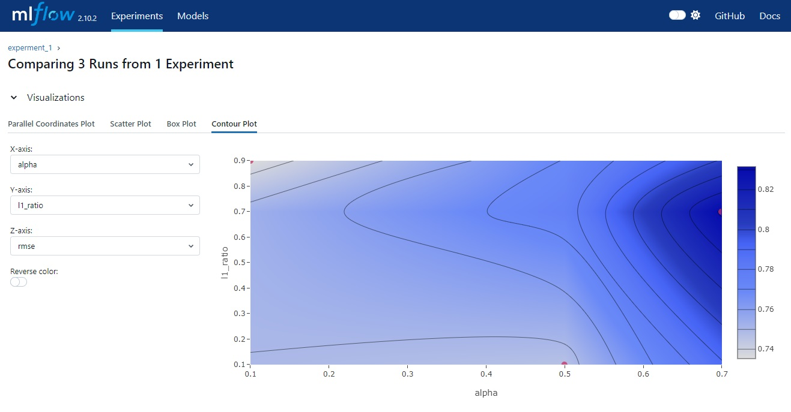
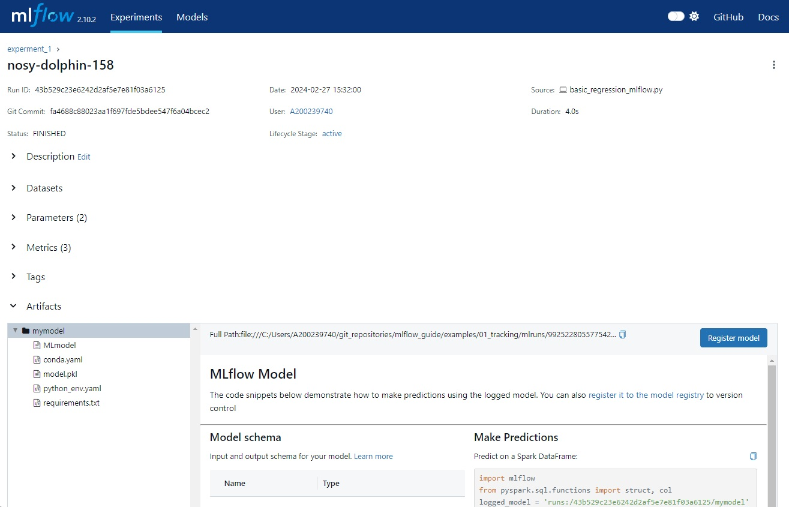

# MLflow

These are my personal notes on how to use MLflow, compiled after following courses and tutorials, as well as making personal experiences.

**The main course I followed to structure the guide is [MLflow in Action - Master the art of MLOps using MLflow tool](https://www.udemy.com/course/mlflow-course), created by J Garg and published on Udemy.**

I also followed the official MLflow tutorials as well as other resources; in any case, these are all referenced.

In addition to the current repository, you might be interested in my notes on the Udacity ML DevOps Nanodegree, which briefly introduces MLflow, [mlops_udacity](https://github.com/mxagar/mlops_udacity):

- [Reproducible Model Workflows](https://github.com/mxagar/mlops_udacity/blob/main/02_Reproducible_Pipelines/MLOpsND_ReproduciblePipelines.md)
- [Deploying a Scalable ML Pipeline in Production](https://github.com/mxagar/mlops_udacity/blob/main/03_Deployment/MLOpsND_Deployment.md)

## Overview

- [MLflow](#mlflow)
  - [Overview](#overview)
  - [1. Introduction to MLOps](#1-introduction-to-mlops)
  - [2. Introduction to MLflow](#2-introduction-to-mlflow)
    - [Components](#components)
    - [Setup](#setup)
  - [3. MLflow Tracking Component](#3-mlflow-tracking-component)
    - [Basic Tracking - 01\_tracking](#basic-tracking---01_tracking)
    - [MLflow UI - 01\_tracking](#mlflow-ui---01_tracking)
    - [Extra: MLflow Tracking Quickstart with Server, Model Registration and Loading](#extra-mlflow-tracking-quickstart-with-server-model-registration-and-loading)
  - [4. MLflow Logging Functions](#4-mlflow-logging-functions)
    - [Get and Set Tracking URI - 02\_logging](#get-and-set-tracking-uri---02_logging)
    - [Experiment: Creating and Setting - 02\_logging](#experiment-creating-and-setting---02_logging)
    - [Runs: Starting and Ending - 02\_logging](#runs-starting-and-ending---02_logging)
  - [5. Launch Multiple Experiments and Runs](#5-launch-multiple-experiments-and-runs)
  - [6. Autologging in MLflow](#6-autologging-in-mlflow)
  - [7. Tracking Server of MLflow](#7-tracking-server-of-mlflow)
  - [8. MLflow Model Component](#8-mlflow-model-component)
  - [9. Handling Customized Models in MLflow](#9-handling-customized-models-in-mlflow)
  - [10. MLflow Model Evaluation](#10-mlflow-model-evaluation)
  - [11. MLflow Registry Component](#11-mlflow-registry-component)
  - [12. MLflow Project Component](#12-mlflow-project-component)
  - [13. MLflow Client](#13-mlflow-client)
  - [14. MLflow CLI Commands](#14-mlflow-cli-commands)
  - [15. AWS Integration with MLflow](#15-aws-integration-with-mlflow)
  - [Authorship](#authorship)
  - [Interesting Links](#interesting-links)

The examples are located in [`examples/`](./examples/).

## 1. Introduction to MLOps

See [Building a Reproducible Model Workflow](https://github.com/mxagar/mlops_udacity/blob/main/02_Reproducible_Pipelines/MLOpsND_ReproduciblePipelines.md).

## 2. Introduction to MLflow

[MLflow](https://mlflow.org/docs/latest/index.html) was created by Databricks in 2018 and keeps being maintained by them; as they describe it...

> MLflow is an open-source platform, purpose-built to assist machine learning practitioners and teams in handling the complexities of the machine learning process. 
> MLflow focuses on the full lifecycle for machine learning projects, ensuring that each phase is manageable, traceable, and reproducible.
> MLflow provides a unified platform to navigate the intricate maze of model development, deployment, and management.

Main MLflow components:

- Tracking: track experiements and compare parameters and results/metrics.
- Projects: package code to ensure reusability and reproducibility.
- Model and model registry: packaging for deployment, storing, and reusing models.

Additional (newer) components:

- MLflow Deployments for LLMs
- Evaluate
- Prompt Engineering UI
- Recipes

MLflow...

- is Language agnostic: it is a modular API-first approach, can be used with any language and minor changes are required in our code.
- is Compatible: can be used in combination with any ML library/framework (PyTorch, Keras/TF, ...).
- supports Integration tools: Docker containers, Spark, Kubernetes, etc.

### Components

As mentioned, the main/foundational components are:

- Tracking
- Projects
- Model
- Model registry

Other points:

- Local and remote tracking servers can be set.
- There is a UI.
- There is a CLI.
- Packaged models support many framework-model *flavours*, and can be served in varios forms, such as docker containers and REST APIs.

### Setup

In order to use MLflow, we need to set up a Python environment and install MLflow using the [`requirements.txt`](./requirements.txt) file; here a quick recipe with the [conda](https://conda.io/projects/conda/en/latest/user-guide/install/index.html) environment manager and [pip-tools](https://github.com/jazzband/pip-tools):

```bash
# Set proxy, if required

# Create environment, e.g., with conda, to control Python version
conda create -n mlflow python=3.10 pip
conda activate mlflow

# Install pip-tools
python -m pip install -U pip-tools

# Generate pinned requirements.txt
pip-compile requirements.in

# Install pinned requirements, as always
python -m pip install -r requirements.txt

# If required, add new dependencies to requirements.in and sync
# i.e., update environment
pip-compile requirements.in
pip-sync requirements.txt
python -m pip install -r requirements.txt

# To delete the conda environment, if required
conda remove --name mlflow --all
```

## 3. MLflow Tracking Component

### Basic Tracking - 01_tracking

MLflow distinguishes:

- Experiments: logical groups of runs
- Runs: an experiment can have several runs, which is a single code execution,
  - each with a defined set of hyperparameters, which can be specific to the run and a specific code version,
  - and where run metrics can be saved.

In the section example, a regularized linear regression is run using `ElasticNet` from `sklearn` (it combines L1 and L2 regularizations).

Summary of [`01_tracking/basic_regression_mlflow.py`](./examples/01_tracking/basic_regression_mlflow.py):

```python
# Imports
import mlflow
import mlflow.sklearn
from mlflow.models import infer_signature

# ...
# Fit model
# It is recommended to fit and evaluate the model outside
# of the `with` context in which the run is logged:
# in case something goes wrong, no run is created
lr = ElasticNet(alpha=alpha, l1_ratio=l1_ratio, random_state=42)
lr.fit(train_x, train_y)
# Predict and evaluate
predicted_qualities = lr.predict(test_x)
(rmse, mae, r2) = eval_metrics(test_y, predicted_qualities)

# Create experiment, if not existent, else set it
exp = mlflow.set_experiment(experiment_name="experment_1")

# Infer the model signature
signature = infer_signature(train_x, lr.predict(train_x))

# Log run in with context
with mlflow.start_run(experiment_id=exp.experiment_id):    
    # Log: parameters, metrics, model itself
    mlflow.log_param("alpha", alpha)
    mlflow.log_param("l1_ratio", l1_ratio)
    mlflow.log_metric("rmse", rmse)
    mlflow.log_metric("r2", r2)
    mlflow.log_metric("mae", mae)
    mlflow.sklearn.log_model(
        sk_model=lr,
        artifact_path="wine_model", # dir name in the artifacts to dump model
        signature=signature,
        input_example=train_x[:2],
        # If registered_model_name is given, the model is registered!
        #registered_model_name=f"elasticnet-{alpha}-{l1_ratio}",
    )
```

We can run the script as follows:

```bash
conda activate mlflow
cd .../examples/01_tracking
# Run 1
python ./basic_regression_mlflow.py # default parameters: 0.7, 0.7
# Run 2
python ./basic_regression_mlflow.py --alpha 0.5 --l1_ratio 0.1
# Run 3
python ./basic_regression_mlflow.py --alpha 0.1 --l1_ratio 0.9
```

Then, a folder `mlruns` is created, which contains all the information of the experiments we create and the associated runs we execute.

This `mlruns` folder is very important, and it contains the following

```
.trash/             # deleted infor of experiments, runs, etc.
0/                  # default experiment, ignore it
99xxx/              # our experiment, hashed id
  meta.yaml         # experiment YAML: id, name, creation time, etc.
  8c3xxx/           # a run, for each run we get a folder with an id
    meta.yaml       # run YAML: id, name, experiment_id, time, etc.
    artifacts/
      mymodel/      # dumped model: PKL, MLmodel, conda.yaml, requirements.txt, etc.
        ...
    metrics/        # once ASCII file for each logged metric
    params/         # once ASCII file for each logged param
    tags/           # metadata tags, e.g.: run name, committ hash, filename, ...
  6bdxxx/           # another run
    ...
models/             # model registry, if we have registered any model
  <model_name>/
    meta.yaml
    version-x/
      meta.yaml
```

 Notes:

- We can specify where this `mlruns` folder is created.
- Usually, the `mlruns` folder should be in a remote server; if local, we should add it to `.gitignore`.
- **Note that `artifacts/` contains everything necessary to re-create the environment and load the trained model!**
- **We have logged the model, but it's not registered unless the parameter `registered_model_name` is passed, i.e., there's no central model registry yet without the registering name!**
- Usually, the UI is used to visualize the metrics; see below.

### MLflow UI - 01_tracking

The results of executing different runs can be viewed in a web UI:

```bash
conda activate mlflow
# Go to the folder where the experiment/runs are
cd .../examples/01_tracking
# Serve web UI
mlflow ui
# Open http://127.0.0.1:5000 in browser
```

The UI has two main tabs: `Experiments` and ``Models`.

In `Models`, we can see the registered models.

In `Experiments`, we can select our `experiment_1` and run information is shown:

- We see each run has a (default) name assigned, if not given explicitly.
- Creation time stamp appears.
- We can add param/metric columns.
- We can filter/sort with column values.
- We can select Table/Chart/Evaluation views.
- We can download the runs as a CSV.
- We can select >= 2 runs and click on `Compare`; different comparison plots are possible: 
  - Parallel plot
  - Scatter plot
  - Box plot
  - Contour plot
- We can click on each run and view its details:
  - Parameters
  - Metrics
  - Artifacts: here we see the model and we can register it if we consider the run produced a good one.






### Extra: MLflow Tracking Quickstart with Server, Model Registration and Loading

Source: [MLflow Tracking Quickstart](https://mlflow.org/docs/latest/getting-started/intro-quickstart/index.html)

In addition to the example above, this other (official) example is also interesting: The Iris dataset is used to fit a logistic regression. These new points are shown:

- A dedicated server is started with `mlflow server`; beforehand, we did not explicitly start a server. We can start a server to, e.g., have a local/remote server instance. In the following example, a local server is started. We need to explicitly use the server URI in the code. Additionally, since we now have a server, we don't run `mlflow ui`, but we simply open the server URI.
- MLflow tracking/logging is done using the server URI.
- The model is loaded using `mlflow.pyfunc.load_model()` and used to generate some predictions.

A server is created as follows:

```bash
mlflow server --host 127.0.0.1 --port 8080
# URI: http://127.0.0.1:8080, http://localhost:8080
# To open the UI go to that URI with the browser
```

Example code:

1. ML training and evaluation
2. MLflow tracking with model registration
3. MLflow model loading and using

```python
import mlflow
from mlflow.models import infer_signature

import pandas as pd
from sklearn import datasets
from sklearn.model_selection import train_test_split
from sklearn.linear_model import LogisticRegression
from sklearn.metrics import accuracy_score, precision_score, recall_score, f1_score

### -- 1. ML Training and evaluation

# Load the Iris dataset
X, y = datasets.load_iris(return_X_y=True)

# Split the data into training and test sets
X_train, X_test, y_train, y_test = train_test_split(
    X, y, test_size=0.2, random_state=42
)

# Define the model hyperparameters
params = {
    "solver": "lbfgs",
    "max_iter": 1000,
    "multi_class": "auto",
    "random_state": 8888,
}

# Train the model
lr = LogisticRegression(**params)
lr.fit(X_train, y_train)

# Predict on the test set
y_pred = lr.predict(X_test)

# Calculate metrics
accuracy = accuracy_score(y_test, y_pred)

### -- 2. MLflow tracking with model registration

# Set our tracking server uri for logging
mlflow.set_tracking_uri(uri="http://127.0.0.1:8080")

# Create a new MLflow Experiment
mlflow.set_experiment("MLflow Quickstart")

# Start an MLflow run
with mlflow.start_run():
    # Log the hyperparameters
    mlflow.log_params(params)

    # Log the loss metric
    mlflow.log_metric("accuracy", accuracy)

    # Set a tag that we can use to remind ourselves what this run was for
    mlflow.set_tag("Training Info", "Basic LR model for iris data")

    # Infer the model signature
    signature = infer_signature(X_train, lr.predict(X_train))

    # Log the model
    model_info = mlflow.sklearn.log_model(
        sk_model=lr,
        artifact_path="iris_model",
        signature=signature,
        input_example=X_train,
        registered_model_name="tracking-quickstart",
    )

### -- 3. MLflow model loading and using

# Load the model back for predictions as a generic Python Function model
loaded_model = mlflow.pyfunc.load_model(model_info.model_uri)

predictions = loaded_model.predict(X_test)

iris_feature_names = datasets.load_iris().feature_names

result = pd.DataFrame(X_test, columns=iris_feature_names)
result["actual_class"] = y_test
result["predicted_class"] = predictions

print(result[:4])

```

## 4. MLflow Logging Functions

In this section `mlflow.log_*` functions are explained in detail.

### Get and Set Tracking URI - 02_logging

We can use MLflow tracking in different ways:

- If we simply write python code, `mlruns` is created locally and all information is stored there. Then, we start `mlflow ui` in the terminal, in the folder which contains `mlruns`, to visualize the results.
- We can also run `mlflow server --host <HOST> --port <PORT>`; in that case, in our code we need to `mlflow.set_tracking_uri(http://<HOST>:<PORT>)` to connect to the tracking server and to open the UI we need to open `http://<HOST>:<PORT>` with the browser.
- Additionally, we can use `set_tracking_uri()` to define in the code where the data is/should be stored. Similarly, `get_tracking_uri()` retrieves the location.

Possible parameter values for `set_tracking_uri()`

    empty string: data saved automatically in ./mlruns
    local folder name: "./my_folder"
    file path: "file:/Users/username/path/to/file" (no C:)
    URL:
      (local) "http://localhost:5000"
      (remote) "https://my-tracking-server:5000"
    databricks workspace: "databricks://<profileName>"

The file [`02_logging/uri.py`](./examples/02_logging/uri.py) is the same as [`01_tracking/basic_regression_mlflow.py`](./examples/01_tracking/basic_regression_mlflow.py), but with these new lines:

```python
# We set the empty URI
mlflow.set_tracking_uri(uri="")
# We get the URI
print("The set tracking uri is ", mlflow.get_tracking_uri()) # ""
# Create experiment, if not existent, else set it
exp = mlflow.set_experiment(experiment_name="experment_1")
```

If we change:

- `uri="my_tracking"`
- `experiment_name="experiment_2"`

Then, we're going to get a new folder `my_tracking` beside usual `mlruns`.

We can run the script as follows:

```bash
conda activate mlflow
cd .../examples/02_logging
python ./uri.py

# To start the UI pointing to that tracking folder
mlflow ui --backend-store-uri 'my_tracking'
```

### Experiment: Creating and Setting - 02_logging

Original MLflow documentation:

- [Creating Experiments](https://mlflow.org/docs/latest/getting-started/logging-first-model/step3-create-experiment.html)
- [`mlflow.create_experiment()`](https://mlflow.org/docs/latest/python_api/mlflow.html#mlflow.create_experiment)
- [`mlflow.set_experiment()`](https://mlflow.org/docs/latest/python_api/mlflow.html#mlflow.set_experiment)

The file [`02_logging/experiment.py`](./examples/02_logging/experiment.py) is the same as [`01_tracking/basic_regression_mlflow.py`](./examples/01_tracking/basic_regression_mlflow.py), but with these new lines:

```python
from pathlib import Path

# Create new experiment
# - name: unique name
# - artifact_location: location to store run artifacts, default: artifacts
# - tags: optional dictionary of string keys and values to set tags
# Return: id
exp_id = mlflow.create_experiment(
    name="exp_create_exp_artifact",
    tags={"version": "v1", "priority": "p1"},
    artifact_location=Path.cwd().joinpath("myartifacts").as_uri() # must be a URI: file://...
)

exp = mlflow.get_experiment(exp_id)
print("Name: {}".format(exp.name)) # exp_create_exp_artifact
print("Experiment_id: {}".format(exp.experiment_id)) # 473668474626843335
print("Artifact Location: {}".format(exp.artifact_location)) # file:///C:/Users/.../mlflow_guide/examples/02_logging/myartifacts
print("Tags: {}".format(exp.tags)) # {'priority': 'p1', 'version': 'v1'}
print("Lifecycle_stage: {}".format(exp.lifecycle_stage)) # active
print("Creation timestamp: {}".format(exp.creation_time)) # 1709202652141

# Set existent experiment; not existent, it is created
# - name
# - experiment_id
# Return: experiment object itself, not the id as in create_experiment!
exp = mlflow.set_experiment(
    name="exp_create_exp_artifact"
)
```

### Runs: Starting and Ending - 02_logging

We can start runs outside from `with` contexts.

Original documentation links:

- [`mlflow.start_run()`](https://mlflow.org/docs/latest/python_api/mlflow.html#mlflow.start_run)
- [`mlflow.end_run()`](https://mlflow.org/docs/latest/python_api/mlflow.html#mlflow.end_run)
- [`mlflow.active_run()`](https://mlflow.org/docs/latest/python_api/mlflow.html#mlflow.active_run)
- [`mlflow.last_active_run()`](https://mlflow.org/docs/latest/python_api/mlflow.html#mlflow.last_active_run)

The file [`02_logging/run.py`](./examples/02_logging/run.py) is the same as [`01_tracking/basic_regression_mlflow.py`](./examples/01_tracking/basic_regression_mlflow.py), but with these new lines:

```python
# Start a run
# - run_id: optional; we can set it to overwrite runs, for instance
# - experiment_id: optional
# - run_name: optional, if run_id not specified
# - nested: to create a run within a run, set it to True
# - tags
# - description
# Returns: mlflow.ActiveRun context manager that can be used in `with` block
active_run = mlflow.start_run()

# If we don't call start_run() inside a with, we need to stop it
# - status = "FINISHED" (default), "SCHEDULED", "FAILED", "KILLED"
mlflow.end_run()

# Get current active run
# Returns ActiveRun context manager
active_run = mlflow.active_run()

# Get the last run which was active, called after end_run()
# Returns Run object
mlflow.end_run()
run = mlflow.last_active_run()
print("Active run id is {}".format(run.info.run_id)) # 02ae930f5f2348c6bc3b411bb7de297a
print("Active run name is {}".format(run.info.run_name)) # traveling-tern-43
```


## 5. Launch Multiple Experiments and Runs

## 6. Autologging in MLflow

## 7. Tracking Server of MLflow

## 8. MLflow Model Component

## 9. Handling Customized Models in MLflow

## 10. MLflow Model Evaluation

## 11. MLflow Registry Component

## 12. MLflow Project Component

## 13. MLflow Client

## 14. MLflow CLI Commands

## 15. AWS Integration with MLflow

## Authorship

Mikel Sagardia, 2024.  
You are free to use this guide as you wish, but please link back to the source and don't forget the original, referenced creators, which did the hardest work of compiling all the information.  
No guarantees.  

## Interesting Links

- My notes: [mlops_udacity](https://github.com/mxagar/mlops_udacity)
- [From Experiments 🧪 to Deployment 🚀: MLflow 101 | Part 01](https://medium.com/towards-artificial-intelligence/from-experiments-to-deployment-mlflow-101-40638d0e7f26)
- [From Experiments 🧪 to Deployment 🚀: MLflow 101 | Part 02](https://medium.com/@afaqueumer/from-experiments-to-deployment-mlflow-101-part-02-f386022afdc6)
- [Comprehensive Guide to MlFlow](https://towardsdatascience.com/comprehensive-guide-to-mlflow-b84086b002ae)
- [Streamline Your Machine Learning Workflow with MLFlow](https://www.datacamp.com/tutorial/mlflow-streamline-machine-learning-workflow)
- [MLOps-Mastering MLflow: Unlocking Efficient Model Management and Experiment Tracking](https://medium.com/gitconnected/mlops-mastering-mlflow-unlocking-efficient-model-management-and-experiment-tracking-d9d0e71cc697)
